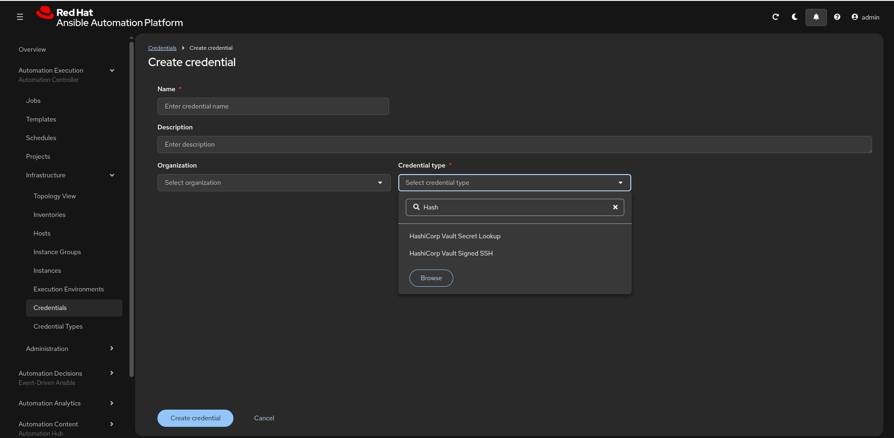
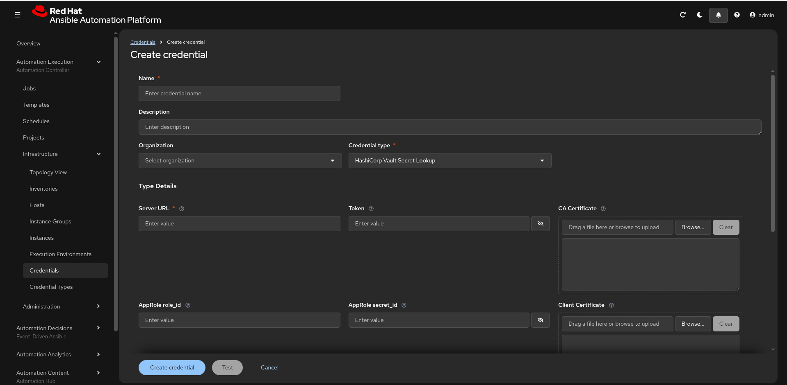

# AAP as an OIDC Identity Provider for HashiCorp Vault

> *"Ansible Automation Platform now acts as an OIDC Identity Provider for
> HashiCorp Vault."* — what that sentence actually means, in plain terms.

**Audience:** customers, sales teammates, and SEs. Use it to explain the feature
in a conversation or to brief yourself before one. No customer-specific detail —
generic patterns only.

**Applies to:** Ansible Automation Platform **2.7** (introduced at Red Hat Summit
2026). Verify exact field names against the 2.7 product docs linked at the bottom
before you configure a live environment.

---

## The one-sentence version

AAP 2.7 can hand **each automation job** a short-lived, cryptographically signed
identity token (a **JWT**). HashiCorp Vault verifies that token and returns **only
the secrets that job is allowed** — so you **stop storing a Vault credential
inside AAP**.

## The problem it solves (lead with this)

Secrets management has a chicken-and-egg problem:

> To pull secrets *out* of Vault, a job needs a credential to authenticate *to*
> Vault. So where do you store **that** credential — securely?

The traditional answer was a **long-lived Vault token** (or AppRole `secret-id`)
stashed inside an AAP credential. That is exactly the kind of standing secret you
were trying to get rid of: it sits in another system, it has to be rotated, and if
it leaks it unlocks Vault.

**AAP-as-OIDC-IdP removes that bootstrap secret entirely.** Instead of *storing* an
identity, the job *proves* its identity at run time with a token AAP signs on the
spot. This is **workload identity** — the same pattern that lets GitHub Actions
authenticate to AWS/GCP and Kubernetes service accounts authenticate to Vault,
with no static cloud key.

## A 30-second OIDC primer

- **OIDC (OpenID Connect)** is an identity layer on top of OAuth 2.0.
- An **Identity Provider (IdP)** signs short-lived **JWTs** (JSON Web Tokens) that
  assert *"this workload is who it claims to be,"* carrying **claims** (facts about
  the caller).
- Any system can **verify** that signature without contacting the IdP live, by
  fetching the IdP's **public keys** from a standard, unauthenticated discovery
  endpoint:
  - `…/.well-known/openid-configuration` — the OIDC discovery document
  - a **JWKS** URL (JSON Web Key Set) — the public keys used to check signatures
- The verifier also checks the claims (issuer, audience, subject, expiry) against
  rules you configure.

In this feature, **AAP is the IdP** and **Vault is the verifier**.

## How it works, end to end

```text
1. A job launches in AAP, using a "HashiCorp Vault … (OIDC)" credential.
        │
        ▼
2. AAP (the OIDC IdP) MINTS a short-lived JWT for THAT job.
   - Signed with AAP's private key
   - Carries claims about the job (issuer, subject, audience, etc.)
   - Expiry is bounded — matches the job timeout when one is set
        │  presents the JWT
        ▼
3. Vault's JWT/OIDC auth method VERIFIES the token:
   - Checks the signature against AAP's JWKS (public keys from discovery URL)
   - Validates the bound claims and audience
   - Maps the token to a Vault ROLE → POLICY
        │  token valid + claims match
        ▼
4. Vault issues a SHORT-LIVED, SCOPED Vault token and returns ONLY the
   secrets that policy permits.
        │
        ▼
5. The job uses the secret. Tokens expire on their own — nothing long-lived
   was stored in AAP, and no standing Vault credential exists for this path.
```

The trust is **one-time setup**: you point Vault's JWT auth method at AAP's OIDC
discovery URL once, and define which AAP claims map to which Vault role/policy.
After that, every job authenticates with a freshly minted, self-expiring token.

## The two credential types

AAP ships two HashiCorp Vault credential types. Pick by **what the job needs from
Vault**:

| Credential type | Use it for |
|-----------------|-----------|
| **HashiCorp Vault Secret Lookup** | Pull a **secret value** out of Vault's KV (or other secret engines) at job run time |
| **HashiCorp Vault Signed SSH** | Have Vault's **SSH secrets engine sign an SSH key/cert** so the job can log into target hosts without a static key |

> **Verified against a live AAP 2.7 build (2026-06-11) — read this before you
> plan a build.** These are the *same two* credential types AAP has shipped for
> several releases; in the 2.7 build tested there is **no separate `(OIDC)`
> variant** and **no JWT/OIDC auth-method field** on either type. The auth methods
> they expose are Token, AppRole (`role_id`/`secret_id`), Client Certificate / TLS,
> Kubernetes role, and userpass — with `Path to Auth` defaulting to `approle`. So
> the AAP-issued-JWT → Vault path described below is the **announced direction**
> (see the Red Hat/HashiCorp references), not something you can wire up through
> these credential types in this build yet. See
> [Verified against a live AAP 2.7 build](#verified-against-a-live-aap-27-build)
> for the screenshots. Treat the JWT/OIDC credential flow as **forward-looking**
> until the fields appear in the product.

## What you configure where

> The **Vault side is real today** — it's the standard JWT/OIDC auth method. The
> **AAP side below describes the announced workload-identity flow**; confirm the
> credential-type fields exist in your build before relying on it (see the
> verification note above).

| Side | What you set up (one time) |
|------|----------------------------|
| **AAP** (announced) | Enable AAP as the OIDC provider; create/attach a HashiCorp Vault credential that authenticates with the **AAP-issued JWT** to the job templates that need Vault |
| **HashiCorp Vault** (available now) | Enable the **JWT/OIDC auth method**; point it at AAP's **OIDC discovery URL / JWKS**; define a **role** with **bound claims** + **bound audiences**; bind that role to a **policy** scoping which secret paths are allowed |

> Treat the exact claim names, the discovery URL path, and the audience value as
> things to **confirm against the AAP 2.7 docs** for your build — the public
> announcements describe the flow but not every field. The Vault side follows the
> standard [JWT/OIDC auth method](https://developer.hashicorp.com/vault/docs/auth/jwt).

## Reference configuration (template)

The "one-time trust" is small enough to show as config-as-code — which is the
best answer to *"how hard is the setup?"* These are **templates**, not runnable
artifacts:

- The **Vault side is structurally complete** — it's the standard JWT auth method
  that exists today; only the `<PLACEHOLDER>` *values* come from AAP's OIDC
  discovery document.
- The **AAP side uses the proven `infra.aap_configuration` data-file pattern.** That
  collection resolves a credential by its `credential_type` **name** against AAP's
  managed types, so it provisions an OIDC HashiCorp Vault credential the moment
  **AAP 2.7** exposes that managed type — no collection change or version gate. The
  only genuine 2.7 unknowns are the **exact credential-type name and input field
  keys**; confirm those against the GA docs.

### Vault side — Terraform (high confidence, structure is stable)

```hcl
# Standard JWT/OIDC auth method. Fill each <PLACEHOLDER> from AAP's OIDC
# discovery document (…/.well-known/openid-configuration) — confirm against
# the AAP 2.7 docs before applying.

# 1. Enable the JWT auth method (mount once)
resource "vault_jwt_auth_backend" "aap" {
  path               = "jwt-aap"
  type               = "jwt"
  oidc_discovery_url = "https://<AAP_HOST>/<OIDC_DISCOVERY_PATH>"  # AAP's discovery base
  bound_issuer       = "https://<AAP_HOST>/<OIDC_ISSUER_PATH>"     # pins the iss claim (optional)
}

# 2. Policy — scope exactly which secret paths a matching job may read
resource "vault_policy" "aap_job" {
  name   = "aap-job-read"
  policy = <<-EOT
    path "secret/data/automation/*" {
      capabilities = ["read"]
    }
  EOT
}

# 3. Role — map AAP's JWT claims to the policy above
resource "vault_jwt_auth_backend_role" "aap_job" {
  backend         = vault_jwt_auth_backend.aap.path
  role_name       = "aap-job"
  role_type       = "jwt"
  token_policies  = [vault_policy.aap_job.name]

  user_claim      = "<USER_CLAIM>"      # claim Vault uses as identity (e.g. sub)
  bound_audiences = ["<AAP_AUDIENCE>"]  # the aud value AAP stamps into the JWT
  bound_claims    = {                   # restrict WHICH AAP identities may assume this role
    "<CLAIM_NAME>" = "<EXPECTED_VALUE>"
  }

  token_ttl       = 300                 # short-lived Vault token
  token_max_ttl   = 600
}
```

<details>
<summary>CLI equivalent (same three steps)</summary>

```bash
# 1. Enable + configure the JWT auth method
vault auth enable -path=jwt-aap jwt
vault write auth/jwt-aap/config \
  oidc_discovery_url="https://<AAP_HOST>/<OIDC_DISCOVERY_PATH>" \
  bound_issuer="https://<AAP_HOST>/<OIDC_ISSUER_PATH>"

# 2. Policy
vault policy write aap-job-read - <<'EOT'
path "secret/data/automation/*" { capabilities = ["read"] }
EOT

# 3. Role
vault write auth/jwt-aap/role/aap-job \
  role_type="jwt" \
  user_claim="<USER_CLAIM>" \
  bound_audiences="<AAP_AUDIENCE>" \
  bound_claims='{"<CLAIM_NAME>":"<EXPECTED_VALUE>"}' \
  token_policies="aap-job-read" \
  token_ttl=300 token_max_ttl=600
```
</details>

### AAP side — `infra.aap_configuration` data file

> ⚠️ **The credential type is real; the OIDC/JWT inputs are not exposed yet.** In
> the tested 2.7 build the `HashiCorp Vault Secret Lookup` type offers Token /
> AppRole / TLS / Kubernetes / userpass auth — **no JWT/OIDC field**. So the block
> below configures a credential of the *right type* but, today, via a classic auth
> method (AppRole shown). When AAP exposes the JWT/OIDC inputs, the same data file
> simply gains those keys — the CaC plumbing doesn't change, because the collection
> resolves the type by **name**.

```yaml
# files/controller_credentials.yml — consumed by the
# infra.aap_configuration.controller_credentials role (the same role used for
# every other credential). Secrets come from env-var lookups, never inline.
controller_credentials:
  - name: "{{ cred_vault }}"
    organization: "{{ my_organization }}"
    credential_type: "HashiCorp Vault Secret Lookup"   # real managed type (no "(OIDC)" variant in 2.7 yet)
    inputs:
      url: "{{ vault_addr }}"      # Server URL, e.g. https://<VAULT_ADDR>:8200
      # --- classic auth path available today (AppRole) ---
      role_id: "{{ vault_role_id }}"
      secret_id: "{{ vault_secret_id }}"
      # default Path to Auth is "approle"; api_version defaults to v1
      # --- the announced OIDC/JWT path would replace the role_id/secret_id pair
      #     with the AAP-issued JWT + a Vault role; add those keys once 2.7 exposes them
```

Then attach the credential to each job template that needs Vault — in the
`infra.aap_configuration.controller_job_templates` data file, add the credential's
name to that template's `credentials:` list (exactly how dc1.azure wires Machine,
cloud, and custom credentials onto its templates today).

### The client side already supports JWT — the gap is narrow

You don't actually need an AAP credential type to *log in* to Vault with a JWT. The
certified [`hashicorp.vault`](https://github.com/ansible-collections/hashicorp.vault)
collection (formerly `community.hashi_vault`) already ships a `jwt` auth method —
`auth_login` accepts `auth_method: jwt` and exchanges a JWT for a scoped Vault token
directly from a play:

```yaml
# Exchange a JWT for a short-lived, scoped Vault token — no stored Vault credential.
- name: Log in to Vault's JWT auth method
  hashicorp.vault.auth_login:
    url: "{{ vault_addr }}"
    auth_method: jwt
    mount_path: jwt-aap          # matches the Vault auth path in the Terraform above
    jwt: "{{ aap_job_jwt }}"     # role is optional — Vault uses the mount's default_role, or pass one
  register: vault_login
# vault_login.login.auth.client_token is then usable for KV reads, SSH signing, etc.
```

So the workload-identity flow has **three** parts, and **two are ready today**:

| Part | Status |
|------|--------|
| Vault JWT/OIDC auth method (trust + role + policy) | **Available now** — standard Vault (Terraform above) |
| Ansible client that logs in with a JWT | **Available now** — `hashicorp.vault.auth_login`, `auth_method: jwt` |
| AAP surfacing each job's **minted JWT** to the EE (`aap_job_jwt` above) | **The one missing piece** in the tested 2.7 build |

That's a useful demo angle: an SE can prove the **Vault + Ansible** side end to end
**today** by feeding a manually-issued test JWT, then swap in the AAP-minted token
once the product surfaces it.

Once the OIDC path ships, the Vault-side `<USER_CLAIM>` / `<AAP_AUDIENCE>` /
`bound_claims` values and the Vault `role` become the *only* coupling between the
two systems — everything else stays independent. That is the whole "one-time
trust": set it once, and every future job authenticates with a freshly minted,
self-expiring token.

## Why it matters — the talking points

1. **No stored Vault credential in AAP.** The bootstrap secret is gone. Fewer
   secrets to manage, rotate, and protect; a smaller attack surface.
2. **Ephemeral by design.** Every interaction with Vault uses a **short-lived**
   token; the AAP JWT's expiry is **bounded to the job** (matches the job timeout
   when available). Nothing long-lived to steal or leak.
3. **Zero standing privileges / zero trust.** A job gets **only the secrets it
   needs, only when it needs them, for as long as the job runs** — "never trust,
   always verify" applied to automation.
4. **AAP becomes the single source of authentication.** Identity and access
   decisions key off the job's verifiable identity, with Vault policies as the
   guardrail. Cleaner audit story: each token traces back to a specific job.

## Likely questions and objections

- **"Is this replacing my existing Vault integration?"** No — it's **additive**.
  The token/AppRole-based HashiCorp Vault credential types still work. OIDC is the
  stronger option when you want to eliminate the stored Vault credential.
- **"Do I have to be on 2.7?"** The OIDC/JWT-to-Vault flow is the **2.7** direction
  (announced; the credential-type inputs were not yet exposed in the build tested —
  see *Verified against a live AAP 2.7 build*). On 2.5/2.6, and on 2.7 today, you
  use the existing token/AppRole credential types.
- **"What stops any job from grabbing any secret?"** Vault's **role → policy**
  binding plus **bound claims** on the JWT. You scope which AAP identities map to
  which policy; Vault enforces least privilege.
- **"What if the AAP signing key rotates?"** Vault re-fetches AAP's public keys
  from the **JWKS** endpoint, so signature verification keeps working across key
  rotation — that's the point of publishing keys at a discovery URL.
- **"Latency / availability?"** Vault validates the JWT signature against cached
  JWKS; there's no live round-trip to AAP per request beyond key refresh.

## Additive, not a forced migration

Existing HashiCorp Vault credentials (token / AppRole) are untouched. Adopt OIDC
where removing the stored Vault credential is worth the one-time trust setup;
leave proven integrations in place until the OIDC path is validated. ("Additive
only — don't remove old capabilities until replacements are proven.")

## Verified against a live AAP 2.7 build

Checked on **2026-06-11** against a running AAP 2.7 environment. The concept in
this doc (AAP issues a JWT → Vault validates it → Vault returns a short-lived
scoped token) is confirmed by the Red Hat/HashiCorp announcements in the
References. The **credential-type plumbing is not yet exposed in the UI**, so treat
the OIDC/JWT credential flow as forward-looking until it appears.

**Only two HashiCorp Vault credential types exist — no `(OIDC)` variant:**



**`HashiCorp Vault Secret Lookup` exposes only classic auth methods — no JWT/OIDC
field** (Token, AppRole `role_id`/`secret_id`, Client Certificate / TLS, TLS
Authentication Role, Kubernetes role, userpass; `Path to Auth` defaults to
`approle`, `API Version` to `v1`):



`HashiCorp Vault Signed SSH` shows the same classic auth field set. Re-check after
each 2.7.z update — the JWT/OIDC inputs may land in a later point release.

## References

- Red Hat — *OIDC authentication for HashiCorp Vault* (AAP 2.7 What's New) —
  https://docs.redhat.com/en/documentation/red_hat_ansible_automation_platform/2.7/whats_new-oidc_authentication_for_hashicorp_vault
- Red Hat blog — *Strengthening security and consistency in the cloud with Red Hat
  and HashiCorp* —
  https://www.redhat.com/en/blog/strengthening-security-and-consistency-cloud-red-hat-and-hashicorp
- HashiCorp blog — *Managing AAP credentials at scale with Vault* —
  https://www.hashicorp.com/en/blog/managing-ansible-automation-platform-aap-credentials-at-scale-with-vault
- HashiCorp Vault — *JWT/OIDC auth method* (the Vault side of the trust) —
  https://developer.hashicorp.com/vault/docs/auth/jwt
- Ansible certified collection — [`hashicorp.vault`](https://github.com/ansible-collections/hashicorp.vault)
  (formerly `community.hashi_vault`); its `auth_login` module already supports
  `auth_method: jwt` — the client side of the workload-identity flow
- HashiCorp validated pattern — *Integrate Vault SSH with AAP* (context for the
  Signed SSH credential type) —
  https://developer.hashicorp.com/validated-patterns/vault/integrate-vault-ssh-with-ansible-automation-platform
