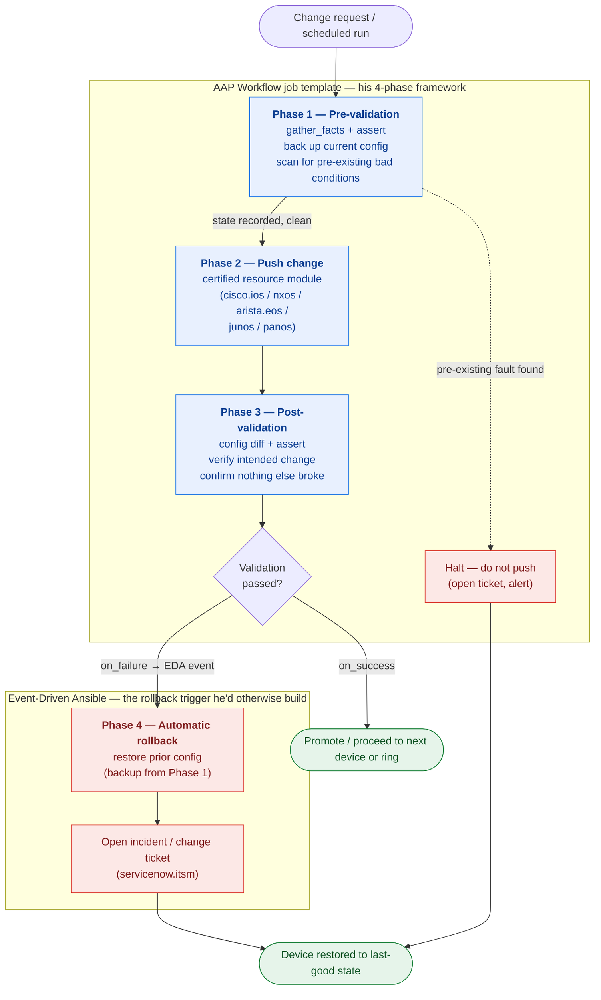

# Talking Points

## Opening Frame (to the lead engineer)

"Walk me through your 4-phase framework — pre-validate, push, post-validate, auto-rollback. … That's a really sound
design. Here's what I want to show you: that exact flow is what an AAP **workflow** runs natively, and the rollback
trigger is **Event-Driven Ansible**. You've essentially written the spec for the platform. So the question isn't
*whether your approach is right* — it clearly is. The question is whether **you want to be the person who builds and
maintains the platform underneath it, or the architect whose design runs on a platform someone else keeps patched and
supported.** Let's look at both honestly, cost included."

That frame does three things: **validates him**, **reframes the decision** (maintainer vs. architect), and **invites
the cost conversation** rather than dodging it.

---

## Key Messages

1. **You've already designed an AAP workflow.** Pre-validate → push → post-validate → rollback-on-failure **is** a
   workflow job template with success/failure branches + **Event-Driven Ansible** for the rollback trigger. We're not
   replacing your design — we're giving it a supported home.
2. **You already made this exact build-vs-buy call — for the OS.** You're building on **RHEL**, not Linux From Scratch.
   You chose the supported, hardened, CVE-pipelined distribution over rolling your own. **Ansible Core → AAP is the
   same relationship as Fedora/CentOS Stream → RHEL.** Apply the decision you already trust.
3. **This isn't proprietary vs. open source.** **AAP is open source.** Ansible Core is the upstream community engine;
   AAP is the productized, supported distribution of it. You're already running our upstream — the choice is whether
   you want the hardening and support on top.
4. **The platform frees you to do the work you were hired for.** Config generation, network architecture — not
   babysitting, patching, and supporting a homegrown orchestrator forever. **Architect, not maintainer.**
5. **Someone has to own the CVEs.** A self-built platform means *you* own every vulnerability in your orchestration
   code, your PHP/Python, and every unvetted Galaxy collection you pull. AAP ships **certified, signed content** with a
   **Red Hat security response pipeline** behind it.
6. **In a life-safety system, "only one person understands it" is a defect, not a feature.** Bus factor is an
   operational risk you carry personally today. The platform makes the automation **survive your vacation.**
7. **AI changes who writes the code, not who owns it.** Generating a platform with AI doesn't remove the burden of
   securing, supporting, and understanding it — and code only one person (or no one) fully grasps is a *worse*
   bus-factor problem. **Use AI to write automation content; run it on a platform you didn't have to build.**

---

## The capability map — "everything you'd otherwise build and maintain"

> Use this to make the hidden iceberg visible. He sees the GUI; the GUI is the tip.

| His 4-phase framework needs… | He'd build & maintain | AAP ships it, supported |
|---|---|---|
| Run the 4 phases with branching logic | A workflow/orchestration engine | **Workflow job templates** (visual, branch on success/failure) |
| **Phase 1 — pre-validation** (record state, scan for bad conditions) | Fact-gather + assert scripts | **`gather_facts` / network resource modules + `assert`**, config backup |
| **Phase 2 — push change** | Config-push scripts per vendor | **Certified network collections** (`cisco.ios`, `nxos`, `arista.eos`, `junipernetworks.junos`, `paloaltonetworks.panos`) |
| **Phase 3 — post-validation** | Re-check + diff scripts | **Resource-module config diff + `assert`/validate**, `ansible.netcommon` |
| **Phase 4 — auto-rollback on failure** | A trigger + revert mechanism | **Event-Driven Ansible** trigger → **rollback job** (restore prior config) |
| Who changed what, when | Logging + a database + a UI | **Built-in audit trail + RBAC** |
| Secrets out of scripts | A vault integration | **Credential store / external secrets integration** |
| Reproducible runs | Pin Python, deps, OS libs | **Execution Environments** (versioned containers) |
| Thousands of devices, multiple sites | Queueing, workers, distribution | **Automation mesh** |
| Let others run it safely | AuthN/Z + self-service UI | **Surveys + RBAC** |
| Stay patched & secure | Track CVEs across your whole stack | **Certified, signed content + Red Hat security response** |
| Help at 2 a.m. | Be the help, alone | **Support SLA** |

---

## His 4-phase framework, drawn as an AAP workflow

> Whiteboard this (or screen-share it) right after he explains his framework. The point lands visually:
> **every box is a job he already designed; the canvas, the branching, and the rollback trigger are what AAP adds —
> supported, with no orchestration engine for him to build.**

**How to talk to it:**

- **Phases 1–3 are jobs** — content he writes (and owns) on *either* platform. Nothing here is a Red Hat lock-in.
- **The canvas, the `on_success`/`on_failure` branches, and the gate** are the **workflow job template** — the
  orchestration engine he'd otherwise have to build and maintain.
- **The `on_failure → Phase 4` path** is **Event-Driven Ansible**: the failure emits an event, a rulebook reacts and
  fires the rollback job. *That* trigger-and-react mechanism is the heart of what he was about to hand-build.
- The **dashed "pre-existing fault" branch** out of Phase 1 is his "scan for bad conditions before touching anything"
  step — model it as a halt-and-alert so a change never pushes onto an already-broken device.
- Everything in **red** (rollback, ticketing, halt) is the safety net; everything in **green** is a clean outcome —
  device either advances or returns to a known-good state. **No path leaves a device in an unknown state.** That last
  sentence is the one to say out loud in a life-safety room.

---

## Answering the cost objection honestly (TCO, not sticker price)

Don't dismiss it — **the per-node concern is legitimate.** Reframe the comparison:

- **What he's comparing:** `AAP subscription` vs. `$0 (Ansible Core is free)`. That comparison is **wrong**.
- **The honest comparison:** `AAP subscription` vs. `the fully-loaded cost of the homegrown platform`, which includes:
  - **His time** to build it — and the **opportunity cost** of *not* doing network engineering while he does.
  - **Ongoing maintenance** — every OS/Python/dependency upgrade, every collection change, forever.
  - **Security ownership** — tracking and patching CVEs across the whole self-built stack.
  - **On-call / support** — he *is* the SLA, 24/7, for a life-safety system.
  - **Bus-factor insurance** — what the org spends (or loses) when the one expert is unavailable.
  - **The cost of a single outage** in a life-safety context — typically the number that dwarfs all the others.
- **Land it as:** "Free isn't free — it's **deferred and personal**. The question for the business is whether a
  **bounded, supported subscription** is cheaper than an **unbounded liability that lives in one person's head.**"

> Don't invent or quote specific pricing — push exact figures and any subscription-model nuance to a follow-up with
> the account team. Win the **framing** here, not the number.

---

## Per-audience tracks

### Track A — The lead engineer (primary)

- **Lead with respect for his design.** Have him explain the 4-phase framework; map it live to workflow + EDA.
- **Maintainer → architect.** "Do you want your legacy here to be a platform you can never stop maintaining, or a set
  of automation that outlives any single tool and any single person — including you?"
- **Config generation is yours either way.** Take it off the table as a point of contention; it runs on Core or AAP.
- **The RHEL analogy** is the closer — he already trusts this decision pattern.

### Track B — The executives (accountability)

- **One word: risk.** A life-safety change pipeline whose orchestrator is understood by **one newly-promoted person**
  is a **single point of failure** you are accountable for.
- **Supportability:** when the homegrown rollback fails *during* an outage, who do you call? With a platform, there's
  an answer. Without one, the answer is "the one engineer, if he's reachable."
- **Continuity:** promotions, departures, vacations, illness happen. The automation must not depend on one résumé.
- **Auditability & accountability:** a platform gives you defensible **who-changed-what-when** evidence by default —
  exactly what leadership needs when something goes wrong and questions get asked.
- **Frame as insurance, not tooling:** the subscription is the cheap, bounded line item; the homegrown path is the
  unbounded, unbudgeted liability.

### Track C — The Red Hat sales team (how to play it)

- **Do NOT feature-dump.** This buyer is technical and proud; a capability list reads as a threat to his work.
- **Open by honoring his design**, then make the iceberg visible (capability map) and let him reach the conclusion.
- **Qualify the real drivers:** scale & vendor mix (cost reality + collection coverage), change-control/audit
  requirements, team size, **on-call/continuity**, and whether the 4-phase framework is idea-stage or already in prod.
- **Sell the proof-of-value, not the platform:** "Let's run *your* 4-phase flow as a workflow on a few of your real
  devices and you tell me if it's what you were about to build." Lets him validate, not be sold to.
- **Bring the cost conversation to the account team** for real numbers — win framing in the room, not figures.

---

## Supporting Evidence

- **The 4-phase ↔ workflow + EDA mapping is exact**, not analogy — demo it (see [resources.md](resources.md)).
- **Certified network collections exist** for every major vendor he'll touch — config generation and push are
  solved, supported content, not something he must hand-roll.
- **Ansible Core is Red Hat's upstream** — the OSS-vs-proprietary framing collapses on inspection.
- **He already runs RHEL** — the build-vs-buy precedent is sitting under his own platform.

## Things to Avoid

- **Don't disparage his framework or his skills.** They're the asset and the opening. Validate first, always.
- **Don't make it proprietary vs. open source.** AAP is open source; he's already running the upstream.
- **Don't dismiss the cost objection.** It's legitimate — answer with TCO and cost-of-outage, never "trust us."
- **Don't be anti-AI.** AI-assisted authoring is good; just redirect it to **content on the platform**, not to
  **building the platform**.
- **Don't imply AAP is effort-free magic.** It's a platform you adopt and operate — the win is *shared, supported*
  operation vs. *solo, unsupported* operation.
- **Don't quote pricing off the cuff.** Win the framing; route numbers to the account team.
- **Don't pressure or condescend.** The goal is *he* concludes it — a cornered, proud engineer digs in.
- Prefer **`ansible.platform`** modules over legacy `ansible.controller` when describing AAP-as-code.
